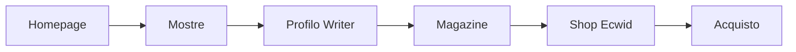

# SPEC — TagTales Gallery

Specifica funzionale per lo stato **live attuale** e i criteri di verifica. Scope allineato al PRD (3 mesi = consolidamento prodotto esistente).

---

## 1. Vetrina pubblica

### 1.1 Homepage e navigazione
- **Route:** `/`, `/en`
- **Layout:** `PublicLayout` (Header + Footer obbligatori)
- **Contenuti:** hero mostra in evidenza, link a mostre, writers, magazine, assistenza
- **Verifica:** pagina carica in IT; LanguagePrompt propone EN; nessun overflow layout mobile

### 1.2 Mostre
- **Route:** `/exhibitions`, `/exhibitions/:slug` (+ varianti `/en/...`)
- **Dati:** Firestore `mostre`
- **Verifica:** lista mostre visibile; dettaglio mostra con blocchi modulari; immagini con radius da `IMAGE_RADIUS`

### 1.3 Writers
- **Route:** `/writers`, `/writers/:slug`
- **Verifica:** profilo writer pubblico; opere collegate

### 1.4 Magazine
- **Route:** `/magazine`, `/magazine/:slug`
- **Verifica:** articoli con prose + `cleanHtml` obbligatorio su HTML da DB

### 1.5 Assistenza / contatti
- **Route:** `/assistenza`, form contatti
- **Verifica:** messaggio inviato → email admin via Resend (`admin_new_register` / template contatti)

---

## 2. Percorso collezionista (critico)



**Criteri di successo:**
- Ogni step è raggiungibile in max 3 click dalla home
- Link shop Ecwid funzionante con `ECWID_STORE_ID` configurato
- Checkout completabile su Ecwid (test manuale o ordine test)

---

## 3. Autenticazione e ruoli

### 3.1 Registrazione / login
- **File:** [`src/pages/Login.tsx`](src/pages/Login.tsx)
- Email/password + Google OAuth (produzione: `auth.tagtalesgallery.com`)
- Super-admin: `claudio@brignole.ch`, UID `ZVQqmqZ99yPV6vVThQ56v9YjZsK2`
- **Locale dev:** pulsante "Dev: accedi come admin" + `serviceAccountKey.json` o `FIREBASE_SERVICE_ACCOUNT_BASE64`

### 3.2 Autorizzazione
- **Firestore rules:** `isAdmin()` con fallback email hardcoded + ruolo `admin` in `users/{uid}`
- **Client:** `Layout.tsx`, pagine `/app/admin/*` verificano ruolo o email super-admin
- **Verifica:** admin vede menu completo; writer vede dashboard limitata; soft-delete utenti (`isDeleted: true`, mai `deleteDoc` su users)

### 3.3 Email transazionali
- **File:** [`src/utils/emailService.ts`](src/utils/emailService.ts), [`server.ts`](server.ts) `/api/send-email`
- Resend con `SMTP_FROM=tagtales@brignole.ch`
- Template: welcome, admin_new_register, chat, contatti

---

## 4. Dashboard writer

- **Route:** `/app/*` (protette da `ProtectedRoute`)
- Profilo, opere, contratti, pagamenti, chat con admin
- **Verifica:** writer non accede a route `/app/admin/*`

---

## 5. Dashboard admin

- **Route:** `/app/admin/*`
- Writers, mostre, articoli, pagine, SEO, newsletter, vendite, contratti, utenti
- **Verifica:** CRUD mostre/articoli; approvazione opere; invio newsletter SendFox

---

## 6. Integrazioni backend

| Integrazione | Endpoint / file | Env principali |
|--------------|-----------------|----------------|
| Ecwid API | `server.ts` `/api/ecwid/*` | `ECWID_STORE_ID`, `ECWID_SECRET_TOKEN` |
| Ecwid webhook | `functions/src/ecwidWebhook.ts` | Configurato in produzione |
| Resend | `server.ts` `/api/send-email` | `RESEND_API_KEY`, `SMTP_FROM` |
| SendFox | `server.ts` newsletter | `SENDFOX_ACCESS_TOKEN_BASE64`, ... |
| Gemini | traduzioni / AI | `GEMINI_API_KEY` |
| PageSpeed | SEO tools | `PAGESPEED_API_KEY` o fallback Gemini |
| Meta Pixel | tracking | `META_PIXEL_ACCESS_TOKEN` (Hostinger) |
| Firebase Admin | dev login, functions | `FIREBASE_SERVICE_ACCOUNT_BASE64` |

**Nota Hostinger:** il codice legge `ECWID_SECRET_TOKEN`, non `ECWID_CLIENT_SECRET`. Se entrambi sono in Hostinger, devono avere lo stesso valore.

---

## 7. Build e deploy

- **Build:** `npm run build` → `dist/` + `dist/server.js`
- **Start:** `node dist/server.js`
- **Non modificare** script build/start (Regola 7 AGENTS.md)
- **Deploy doc:** [`docs/DEPLOY.md`](docs/DEPLOY.md)

---

## 8. Criteri di verifica globali

Prima di ogni release:

```bash
npm run lint      # tsc --noEmit
npm test          # Vitest (utils critici)
npm run test:e2e  # Playwright (vetrina, admin dev, API)
npm run build     # build produzione
```

Manuale (agent `verify-app`):
1. Login dev admin → `/app/admin`
2. Homepage → mostra → writer → magazine
3. Creare mostra/writer/articolo con **Pubblica Online** disattivato → copiare link anteprima → verificare accesso con `?preview=TOKEN`
4. Logout → slug senza token deve mostrare 404
5. Invio form contatti / email test
6. Logout → login writer test (se account disponibile)

---

## 9. Fuori scope SPEC (non testare come requisito)

- AI art generation
- Social feed tra writers
- Aste
- App nativa
- Task ROADMAP non ancora implementati (vedi [`ROADMAP.md`](ROADMAP.md) task `[ ]`)
